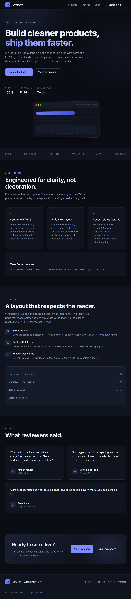

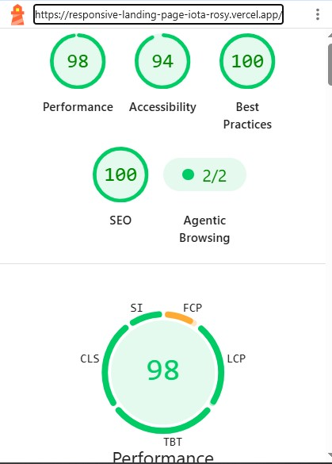

# TaskDesk — Responsive Landing Page

A fully semantic, responsive landing page built for **Week 1** of the Full Stack Development internship at **DawoodTech**.

## Live Links
- **Live Demo:** https://responsive-landing-page-iota-rosy.vercel.app/
- **GitHub Repo:** https://github.com/Adan694/responsive-landing-page

## Overview

A responsive, single-page marketing site for a fictional product called
TaskDesk. Built with semantic HTML5, a Flexbox-based layout system, and
vanilla JavaScript. No build step, no framework.

## Objective

Demonstrate mastery of HTML5 semantics, Flexbox layout systems, and
viewport responsiveness by building a production-shaped landing page.

## Tech stack

- HTML5 (semantic landmarks)
- CSS3 (custom properties, Flexbox, media queries)
- Vanilla JavaScript (ES6)

## Project structure

```
responsive-landing-page/
├── index.html
├── css/
│   └── styles.css
├── js/
│   └── main.js
├── assets/
│   ├── images/
│   │   └── (screenshots and icons)
│   └── fonts/
│       └── (self-hosted font files)
├── README.md
└── .gitignore
```

## Setup

### Option 1 — Open directly in a browser

```bash
git clone https://github.com/Adan694/responsive-landing-page
cd responsive-landing-page
```

Then double-click `index.html`, or drag it into any browser window.
Everything runs without a server.

### Option 2 — VS Code Live Server (recommended)

1. Install the **Live Server** extension in VS Code.
2. Open the project folder in VS Code.
3. Right-click `index.html` → **Open with Live Server**.
4. The page reloads automatically when you save any file.

### Option 3 — Python HTTP server

```bash
python -m http.server 8000
```

Then visit `http://localhost:8000`.

## Screenshots

### Desktop (1440px)



### Mobile (375px)



## Flexbox and Grid — where and why

**Flexbox** is used for:

- The primary navigation bar (`header nav`)
- The hero layout (text column beside the browser mockup)
- Feature cards, process list, testimonial cards, and the footer
- Aligning inline elements: buttons, badges, avatar rows

**CSS Grid** is used only in the browser mockup skeleton, where a fixed
three-column layout is simpler to express than three flex children.
Everywhere else, Flexbox was chosen because the content determines its
own width and needs to wrap on narrow viewports.

## Accessibility

- Semantic landmarks: `header`, `nav`, `main`, `section`, `article`, `aside`, `footer`
- `aria-labelledby` links each section to its heading
- Skip-to-content link for keyboard users
- Mobile menu toggle uses `aria-expanded` and `aria-controls`
- Visible focus rings via `:focus-visible`
- `prefers-reduced-motion` support
- Decorative visuals marked `aria-hidden`

## Responsive breakpoints

| Width | Behavior |
|-------|----------|
| > 860px | Full horizontal navigation, multi-column layout |
| ≤ 860px | Hamburger menu, stacked navigation |
| ≤ 560px | Full-width buttons, simplified visuals |

## Lighthouse

Tested with Chrome DevTools Lighthouse on a production build (Vercel).



## Intern notes

This was my first project focused specifically on HTML semantics and Flexbox
rather than visual polish. The two ideas that shaped everything:

**Semantics.** Writing the HTML outline before touching CSS forced me to
choose elements for their meaning, not their appearance. A blockquote of
praise is not a paragraph with quotes — it is a `blockquote` with a `cite`.
A navigation bar is not a `div` full of links — it is a `nav` with an
`aria-label`. Once the outline held up on its own, styling became much
easier because every section had a clear job.

**Flexbox.** The rule I kept coming back to was: let the content decide.
`flex: 1 1 260px` on a card means it starts at 260px and grows to fill
space, and wraps automatically when the container is too narrow. That one
line replaced what used to be a stack of media-query column overrides.

I also learned that accessibility work is mostly free if the markup is
correct — `prefers-reduced-motion`, keyboard focus, and screen-reader
landmarks were all a handful of lines because the structure was already
right.

## Author

Amna Shahzad — Full Stack Development Intern, DawoodTech